# 如何在OKX交易所注册：轻松获取注册奖励

---

刚进入区块链投资领域的时候，我也在琢磨——OKX到底怎么注册？整个流程会不会很麻烦？注册完能直接开始交易吗？

这篇文章就是我自己的实战经验。从注册到KYC验证，再到第一笔充值和交易，我会把每个步骤、每个可能踩的坑都告诉你。如果你也在考虑入场加密货币交易，或者想找一个靠谱的交易平台，这篇文章应该能帮到你。

---

## 为什么我选择了OKX

开始之前，我对比了好几个交易所。OKX吸引我的原因很简单：交易对多、界面清晰、安全性高。而且它支持现货、合约、P2P等多种交易方式，对新手和老手都挺友好。

更重要的是，OKX的注册流程不复杂，KYC验证也很快——基本上24小时内就能搞定。这对急着入场的人来说，体验还是挺不错的。

## 注册流程：6步搞定

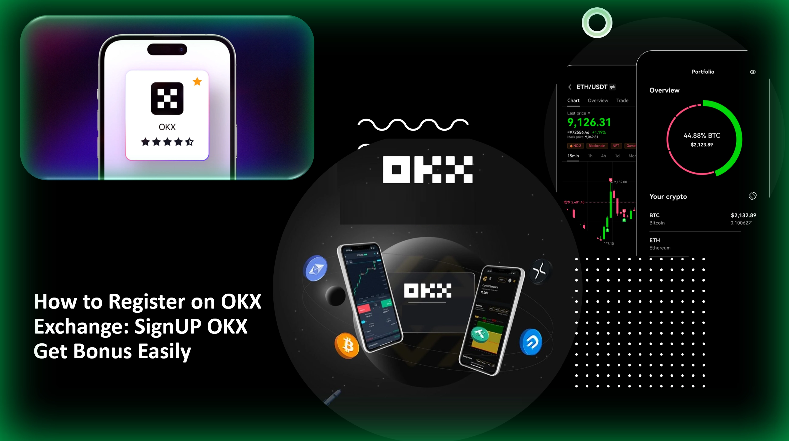

**第一步：进入注册页面**

打开OKX官网首页，点击右上角的"注册"按钮。整个页面设计很简洁，不会让你找不到入口。

**第二步：选择地区并同意条款**

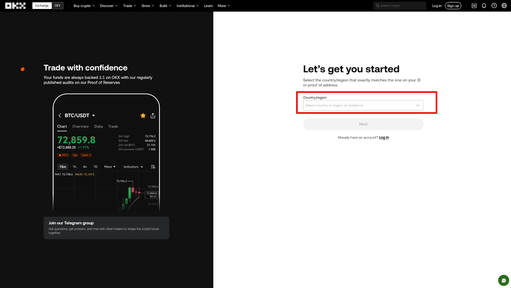

从下拉菜单里选你的居住地。然后快速浏览一下服务条款（虽然大部分人都不会仔细看），勾选同意，点"下一步"。

**第三步：输入邮箱地址**

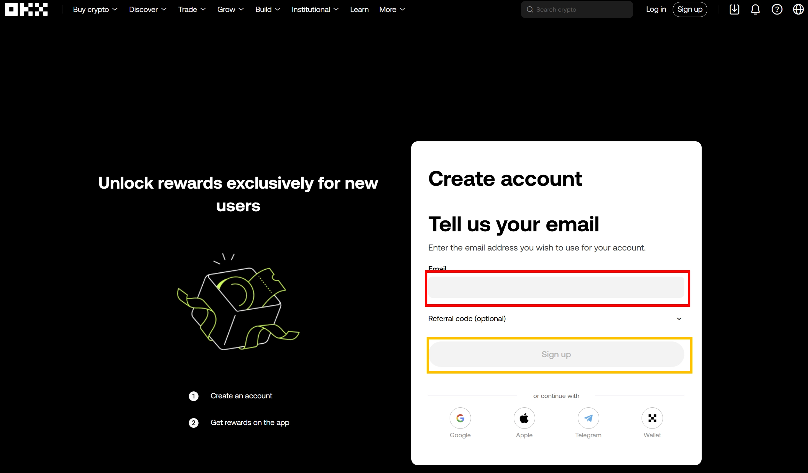

填上你常用的邮箱，然后点"注册"。记得用一个你能长期使用的邮箱，后续验证和通知都会发到这里。

**第四步：验证邮箱**

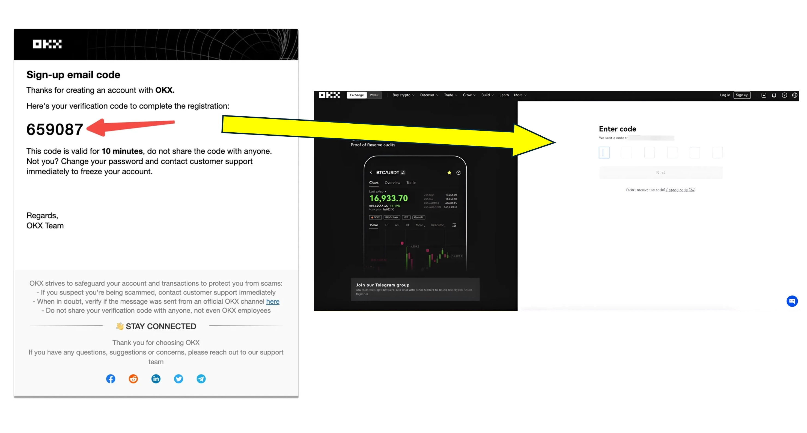

打开邮箱，找到OKX发来的6位数验证码。注意，这个验证码有效期只有10分钟，别磨蹭太久。输入验证码后点"下一步"。

**第五步：验证手机号**

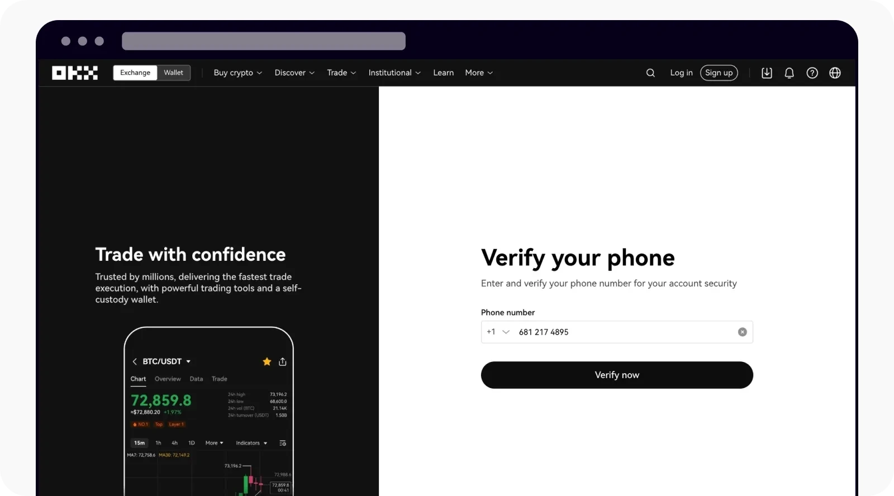

输入你的手机号（带国家区号）。系统会给你发一条短信，里面有6位数的验证码。收到后输入进去，点"下一步"。

**第六步：设置密码**

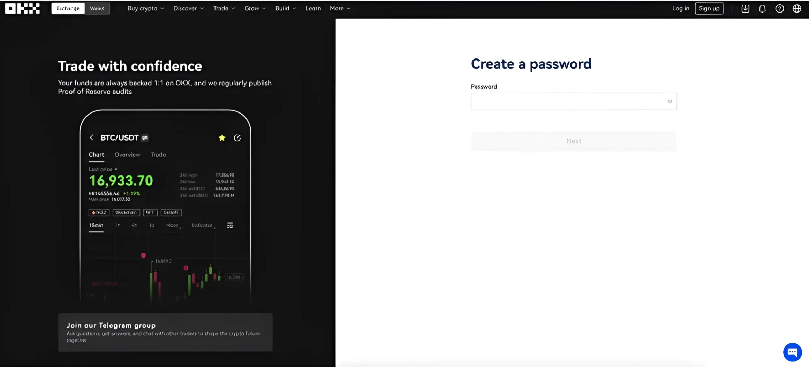

选一个足够安全的密码——最好是数字、字母、符号混合，大小写都有。这个密码关系到你账户的安全，别用生日或者123456这种弱密码。

设置完成后，点"下一步"，你的OKX账户就算开好了。

## KYC身份验证：解锁完整功能

注册完账户只是第一步。想要正常充值、提现，还得完成KYC（身份验证）。这一步也不复杂，而且OKX把它分成了两个等级。

**网页端操作步骤**

点击页面右上角的头像图标，选择"身份验证"。按照提示完成Level 1验证。

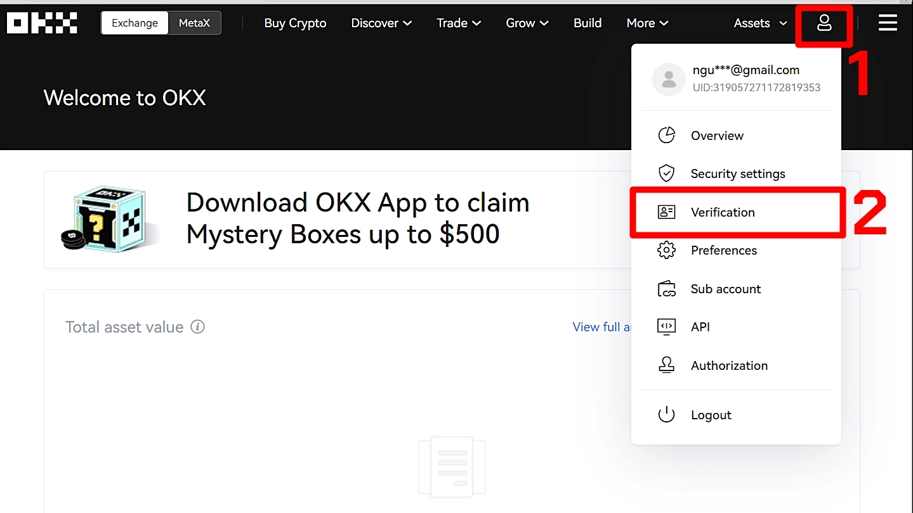

Level 1主要是填一些基本信息，比如姓名、出生日期、地址等。填完后系统会自动审核。

如果想升级到Level 2（提升提现额度），需要上传身份证件照片或护照扫描件，再拍一张自拍照用于人脸识别。记得拍照时不要戴帽子或墨镜，光线要充足，照片要清晰。

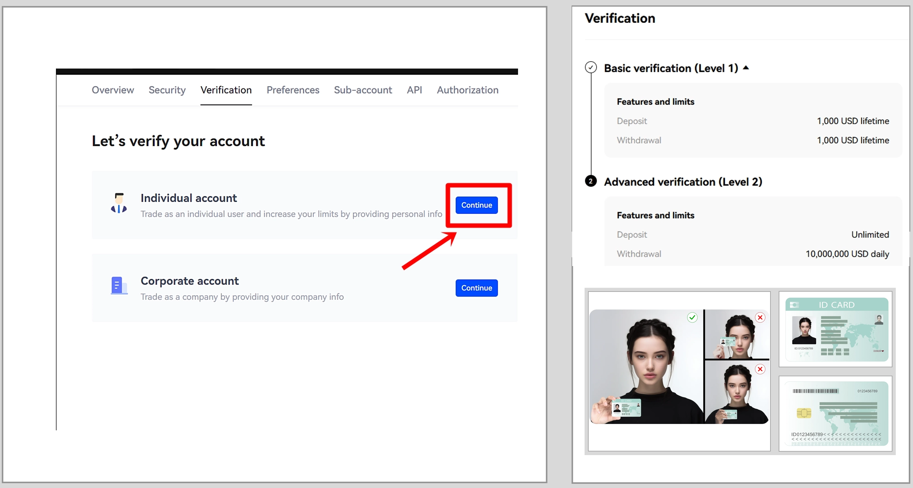

**手机App端操作**

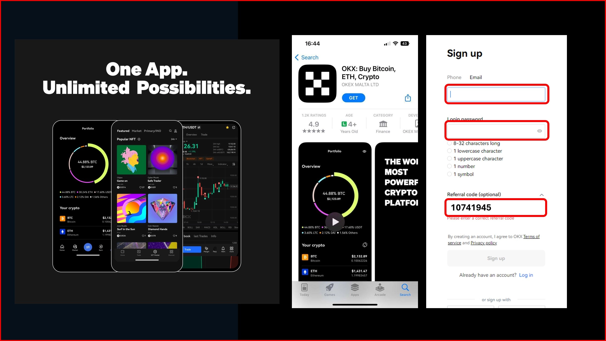

打开OKX App，点右上角的头像，进入"用户中心 > 个人设置 > 身份验证"。后续操作和网页端一样，按提示填信息、上传证件照就行。

**审核要多久？**

OKX的审核通常在24小时内完成。如果超过这个时间还没消息，可以通过页面右下角的在线客服咨询进度。我当时大概等了5个小时就通过了。

## 充值：让账户有钱可用

验证通过后，就该往账户里打钱了。OKX支持多种充值方式，法币和加密货币都可以。

**法币购买加密货币**

点击页面顶部的"买币"标签，会看到三种选项：

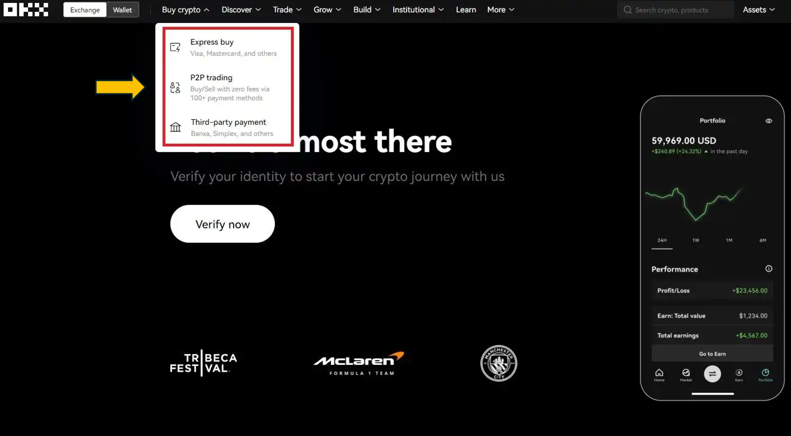

- **快捷买币：** 用Visa、Mastercard或Apple Pay直接购买主流加密货币。支持90多种法币，操作最方便。
- **P2P交易：** 直接和其他用户交易，买卖稳定币特别常用。价格可能比快捷买币稍微优惠一点。
- **第三方支付：** 通过Banxa、Xanpool等合作伙伴完成购买。这些交易由第三方处理，和OKX没有直接关系。

**注意：** 有些地区可能不支持所有支付方式。另外，部分银行对加密货币交易比较敏感，充值前最好先确认一下你的银行卡能不能用。

**链上充币**

如果你已经有加密货币钱包（比如MetaMask或Trust Wallet），可以直接转币到OKX。

步骤如下：

1. 点击右上角的"资产"标签
2. 选择"充币"

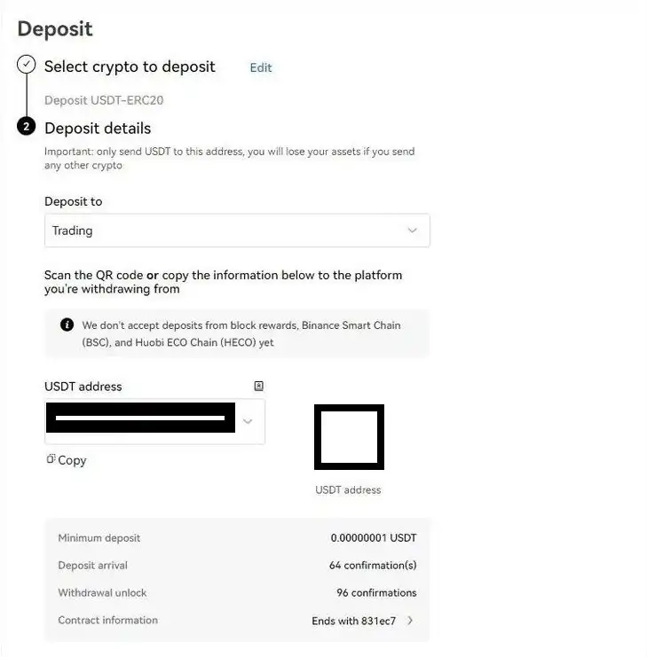

3. 选择要充值的币种
4. 选择对应的网络（比如BTC选择Bitcoin网络，USDT可以选TRC20或ERC20）
5. 决定把币存到"交易账户"（用于现货交易）还是"资金账户"（用于理财产品）
6. 复制充币地址，或者扫描二维码
7. 在你的钱包里发起转账

**重要提示：** 充币地址一定要复制粘贴，千万别手动输入，容易出错。另外，转账时注意选对网络，选错了币就找不回来了。还有，链上转账会有矿工费，金额不大的话不划算。

## 开始交易：从简单到复杂

账户有钱了，就可以开始交易了。点击顶部的"交易"标签，会看到各种交易功能。

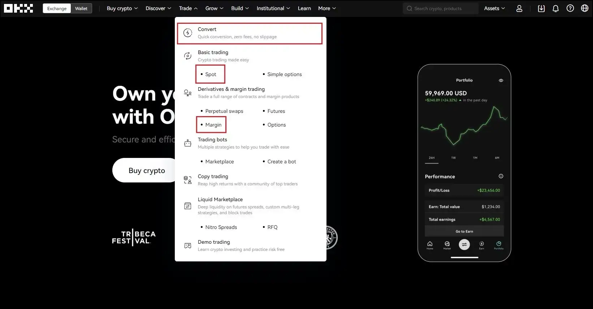

**闪兑功能**

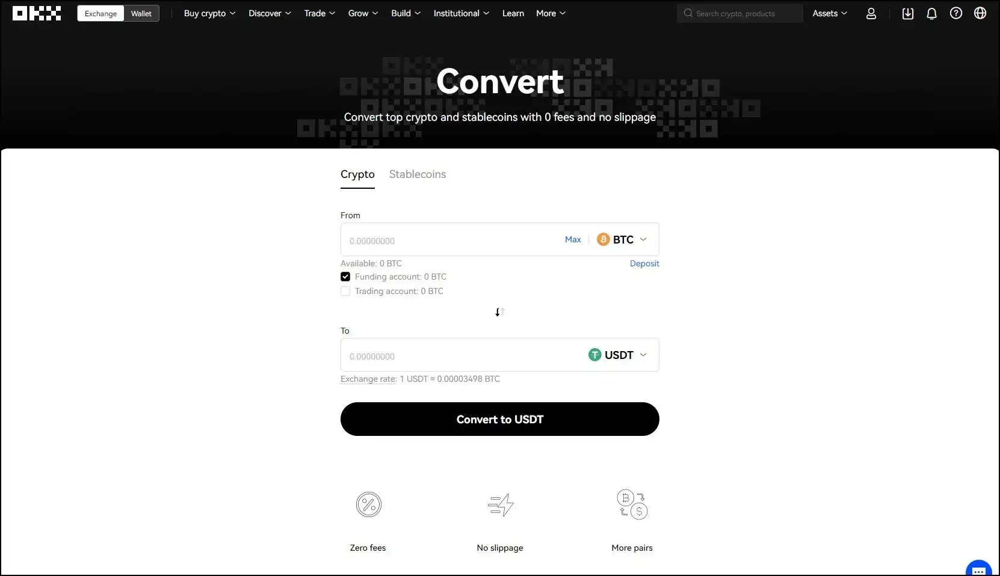

这是最简单的交易方式。选择你想兑换的币种，输入数量，系统会按当前市场价格直接帮你完成兑换。适合新手入门，不需要看K线图或者技术分析。

**现货交易**

现货交易就是买了之后币立刻到账，属于最基础的交易方式。

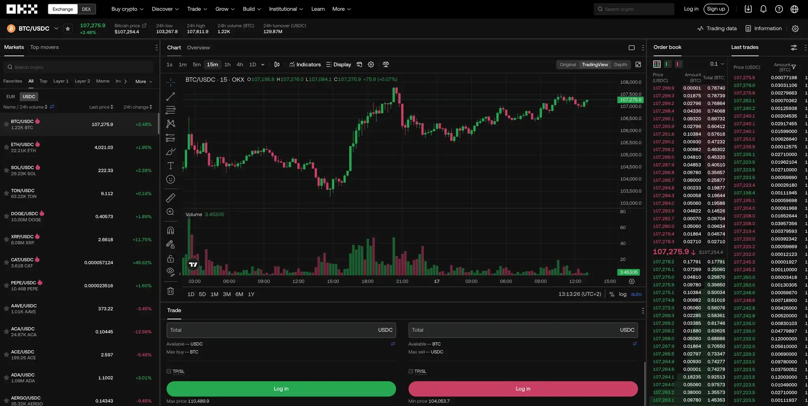

界面主要分几个部分：

- **头部信息栏：** 显示交易对、当前价格、24小时涨跌幅等
- **K线图：** 显示价格走势，可以切换不同时间周期（1分钟、15分钟、1小时、1天等）
- **订单簿：** 右边那一列，显示当前挂单情况
- **下单区域：** 选择买入或卖出，输入价格和数量

**订单类型**

OKX支持多种订单类型，适应不同交易策略：

**市价单：** 

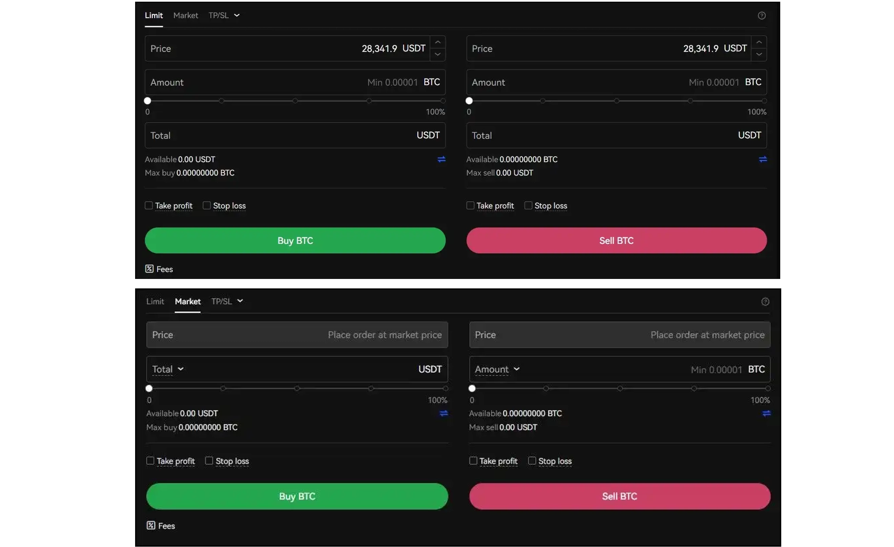

按当前市场价格立即成交。适合急着入场或出场的情况。

**限价单：** 自己设定价格，只有市场价格到达你设定的价位时才会成交。适合想以特定价格买入或卖出的情况。

**止盈止损单：** 设定触发价格，达到后自动执行交易。可以用来锁定利润或限制亏损。OKX支持TPSL（止盈止损）和OCO（二选一）两种模式。

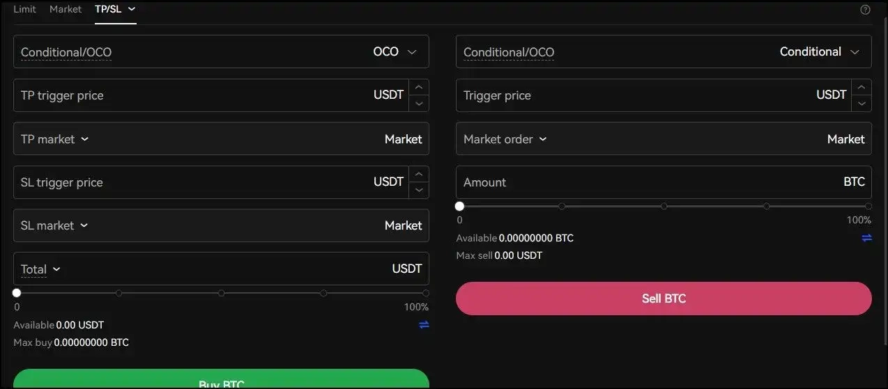

**追踪止损单：** 

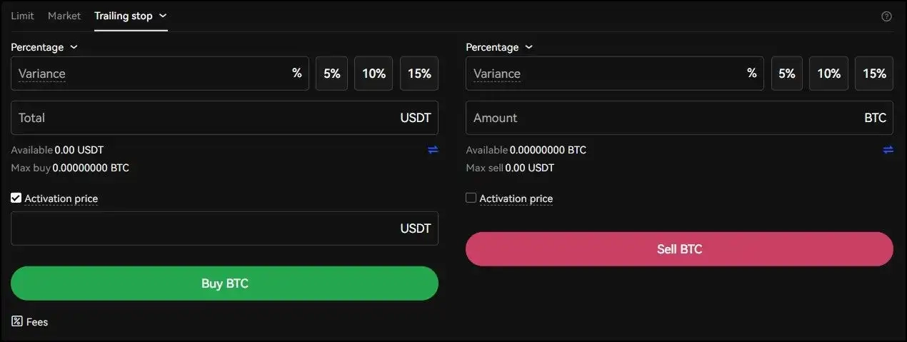

价格朝有利方向变动时，止损价会自动跟随调整。比较适合波动行情中保护利润。

## 杠杆交易：高风险高回报

如果你想放大收益（当然风险也会放大），可以试试杠杆交易。OKX支持最高10倍杠杆，部分币种甚至可以开到125倍（不过真不建议新手玩这么大）。

杠杆交易分两种模式：

**全仓模式：** 所有抵押品共享，一个仓位爆仓可能影响整个账户。风险比较大，但资金利用率高。

**逐仓模式：** 每个交易对单独计算，互不影响。适合想控制风险的交易者。

👉 [想了解更多OKX交易技巧？点这里查看完整的交易功能和优惠活动](https://www.okx.com/join/62834398)

## OKX到底是什么？

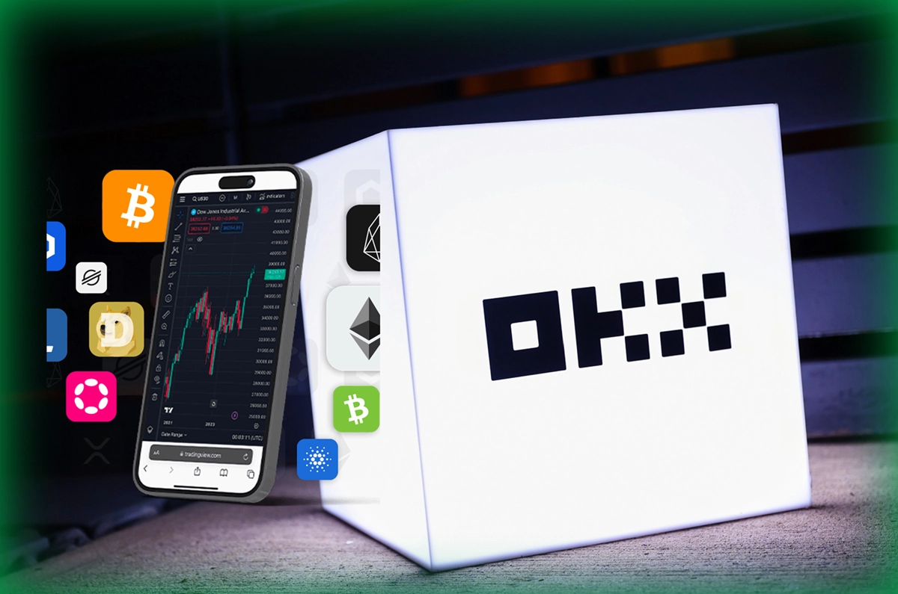

OKX是一家成立于2014年的加密货币交易所，总部在香港。现在已经发展成服务100多个国家、数百万用户的全球性平台。

它提供的服务很全面：现货交易、合约交易、P2P交易、DeFi理财、NFT市场、Web3钱包……基本上你能想到的加密货币相关业务，OKX都有。

从投资背景来看，OKX也挺靠谱——背后有Giant Network Group、龙岭资本、策源创投等知名机构支持。2022年平台从OKEx改名为OKX，美国分支Okcoin也在2023年统一更名为OKX。

**OKX的优势**

用了一段时间后，我觉得OKX有这些明显优点：

- **流动性好：** 日均交易量超过8亿美元，买卖不用担心成交问题
- **安全性高：** 大部分资产存放在冷钱包里，安全措施做得挺到位
- **币种丰富：** 支持300多种代币，500多个交易对
- **交易速度快：** 订单撮合很快,哪怕在行情剧烈波动时也不卡
- **多平台支持：** Windows、Mac、手机App都有,随时随地能交易
- **手续费低：** 交易手续费最低0.02%，VIP用户还能更低
- **客服响应快：** 24小时在线客服，Telegram、邮件、实时聊天都支持

**也有些小缺点**

新功能比较多，刚开始用可能需要花点时间熟悉。不过这对老手来说反而是优势。

## OKX的产品矩阵

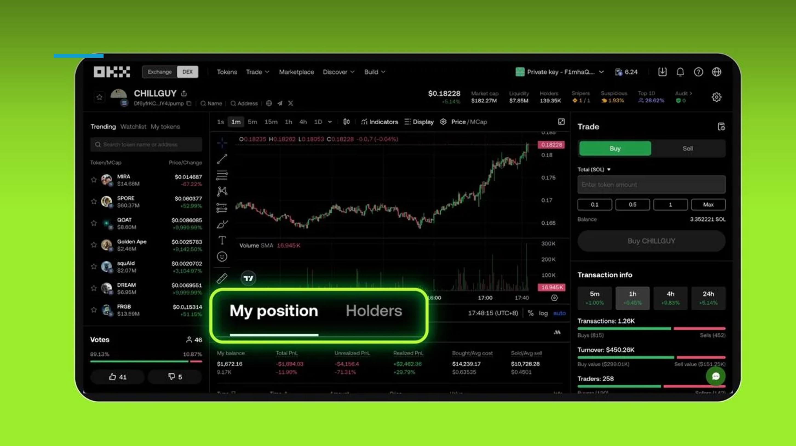

除了基础的现货和合约交易，OKX还提供：

- **交易机器人：** 网格交易、定投、套利机器人，自动化执行交易策略
- **理财和借贷：** 活期和定期理财产品，还能用币做抵押借贷
- **Jumpstart：** OKX的项目启动平台，可以参与新项目的早期投资
- **Web3钱包：** 支持连接80多条区块链，管理多链资产很方便
- **NFT市场：** 覆盖11条区块链，交易NFT不收手续费
- **OKB链和OKT链：** OKX自己的区块链网络，交易费用低、速度快

## 常见问题解答

**不做KYC能用OKX吗？**

可以注册和浏览，但充值、交易、提现这些核心功能都需要完成KYC验证。所以实际上还是得做身份认证。

**新用户有什么优惠？**

新注册用户充值满50美元可以领取神秘盒子奖励。奖励会直接发到账户里。

**如何领取注册奖励？**

注册时使用邀请码62834398，完成KYC验证并充值后，奖励会自动到账。

**OKX的手续费怎么算？**

现货交易手续费是Maker 0.08%，Taker 0.1%。交易量越大，手续费越低。VIP用户可以享受更优惠的费率。

**提现要多久到账？**

链上提现到账时间取决于区块链网络拥堵情况，一般10分钟到1小时不等。

---

## 总结

注册OKX其实挺简单的。从注册到完成KYC，再到开始交易，整个流程半小时左右就能搞定。平台功能丰富、安全性高、手续费也不贵，是个靠谱的选择。

如果你也在考虑进入加密货币市场，OKX是个不错的起点。它的操作界面直观、交易工具齐全、客服响应快——对新手和老手都很友好。👉 [现在注册OKX，使用邀请码62834398即可获得专属奖励](https://www.okx.com/join/62834398)

最后提醒一句：加密货币投资有风险，入场需谨慎。别把所有积蓄都投进去，量力而行最重要。
